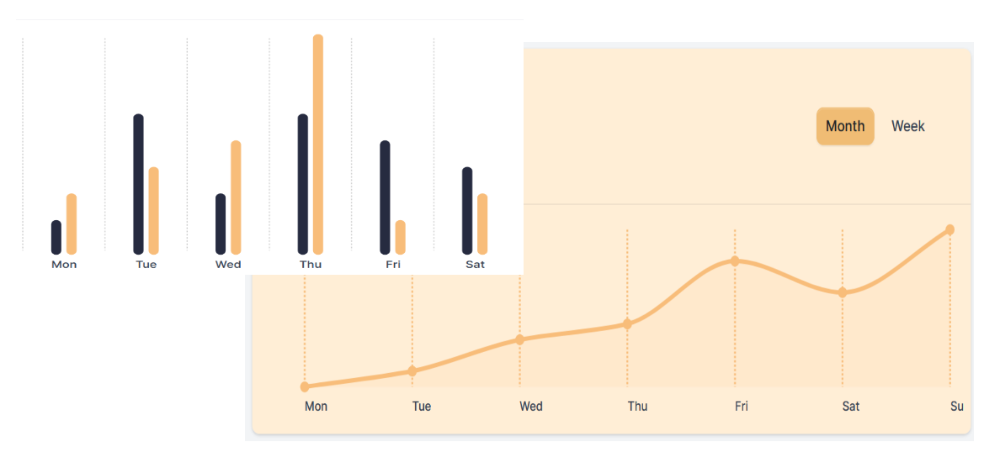

## dash-chartist



 Dash wrapper for the [react-chartist](https://github.com/fraserxu/react-chartist) library

## Usage

    pip install dash-chartist

    python usage.py

```
from dash_chartist import DashChartist
import dash
from dash import  html

external_stylesheets = [
    "https://cdnjs.cloudflare.com/ajax/libs/chartist/0.3.1/chartist.min.css",
    ]

app = dash.Dash(__name__, external_stylesheets=external_stylesheets)


data = {
    "labels": ['W1', 'W2', 'W3', 'W4', 'W5', 'W6', 'W7', 'W8', 'W9', 'W10'],
    "series": [ [1, 2, 4, 8, 6, -2, -1, -4, -6, -2] ]
}

options = {
    "high": 10,
    "low": -10,
}

chartType = 'Bar'

app.layout = html.Div([
    DashChartist(type=chartType, options=options, data=data)
])


if __name__ == '__main__':
    app.run_server(debug=False, host="0.0.0.0", port=5000)
```


